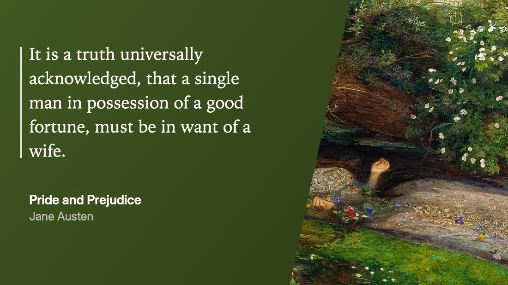
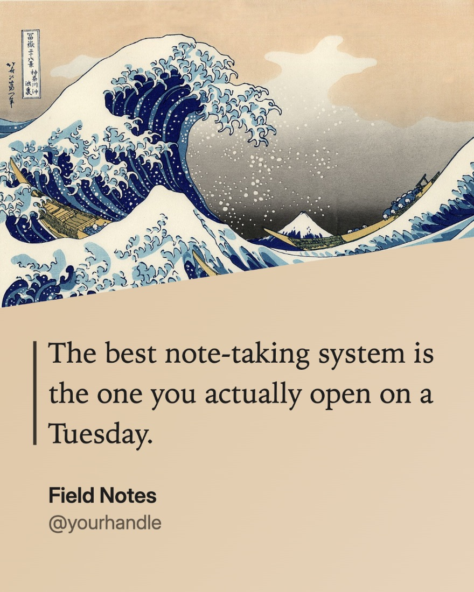
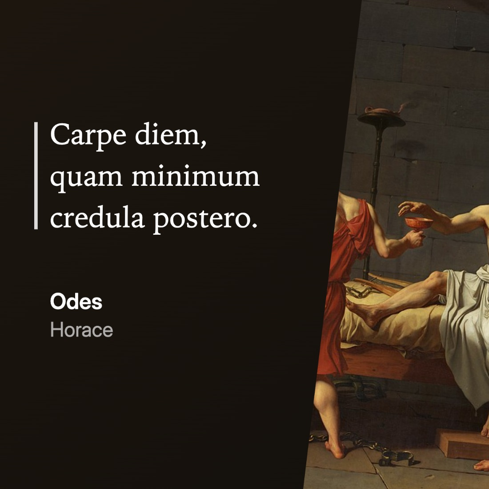
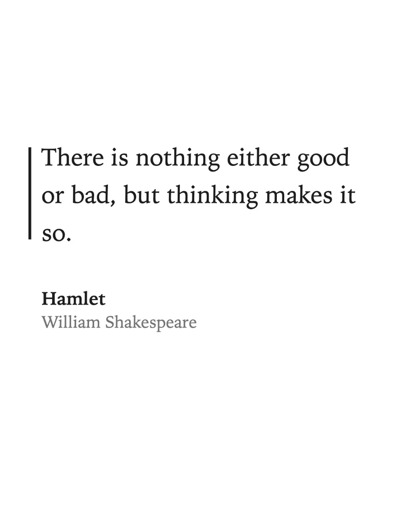
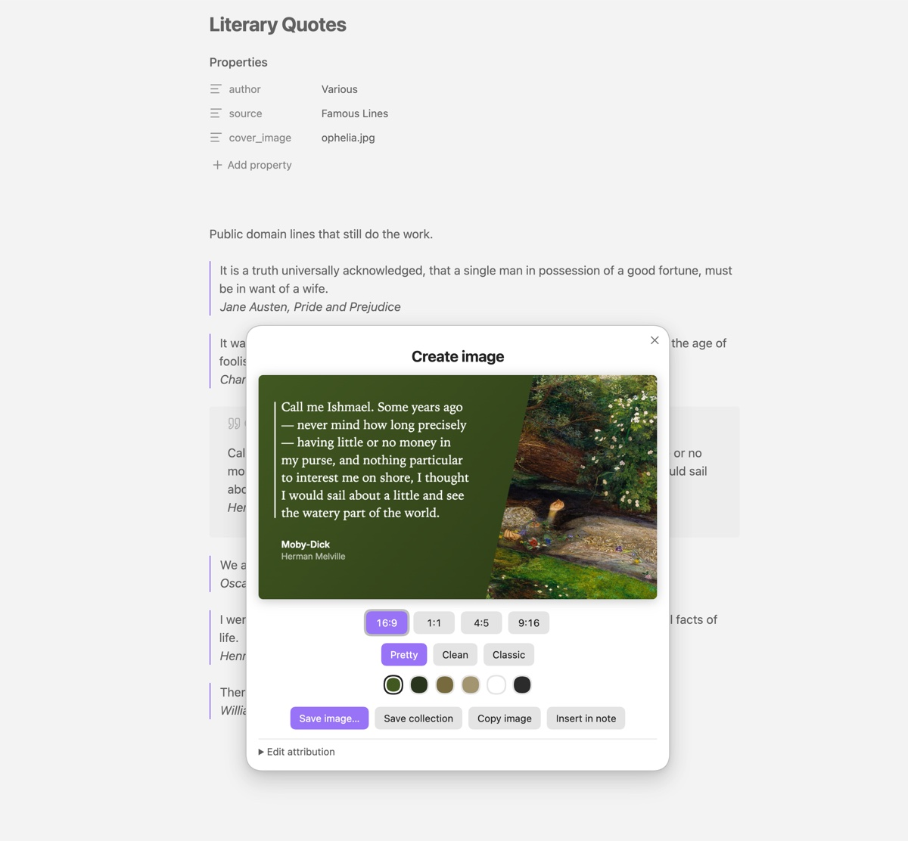

# Quotable

Turn a passage from your notes into a shareable image — with tasteful, customizable cover art, colors pulled from that cover, and your choice of aspect ratios.

Inspired by [Readwise's](https://go.cairn.health/readwise) "pretty image" highlight export, but now you can pull quotes from whatever
is already in your vault.



<p align="center">
  
  
  
</p>

## Using it

Select some text, or put the cursor inside a blockquote or callout, then trigger
**Create image** from any of:

- the command palette
- the editor right-click menu (shown only when there's something to capture)
- the ribbon icon

The share sheet gives you four aspect ratios, three styles, and a row of colours
sampled from the cover art. Attribution is editable in place if the automatic
detection got it wrong.



### Aspect ratios

| Ratio | Size | Suits |
| --- | --- | --- |
| 16:9 | 1920×1080 | Presentations, X/Twitter |
| 1:1 | 1400×1400 | Feed posts |
| 4:5 | 1200×1500 | Instagram portrait |
| 9:16 | 1080×1920 | Stories, Reels |

### Styles

- **Pretty** — the cover art composited behind a colour panel, split on a diagonal.
- **Clean** — flat background, sans-serif, no cover.
- **Classic** — light background, serif, hairline rule.

### Exporting

| Action | What it does |
| --- | --- |
| **Save image** | Writes the current ratio to your device. Desktop opens a save dialog; on iOS it goes through the share sheet, where **Save Image** puts it in Photos. |
| **Save collection** | All four ratios at once — a folder dialog on desktop, one share sheet on iOS. For posting the same quote across platforms. |
| **Copy image** | Straight to the clipboard. |
| **Insert in note** | Saves into the vault and embeds it at the cursor. This is the only action that writes to your vault. |

Options your platform can't support aren't shown — the plugin probes for them at
load, and `Quotable: Report export capabilities` will tell you what it found.

iOS has no way for a plugin to write to the photo library directly; the share sheet
is the supported route, which is why **Save image** opens it there rather than
saving silently. On desktop, saving prefers a real dialog and falls back to a
plain download if the File System Access API isn't available — the button label
tells you which you'll get (an ellipsis means a dialog).

## Where the text comes from

With a selection, that's what you get. Without one, the block containing the cursor
is used: a blockquote or callout if the cursor is in one, otherwise the surrounding
paragraph.

Markdown that would otherwise show up as stray punctuation is cleaned away —
highlight markers, inline code, strikethrough, wikilinks (the display text is kept),
footnote references, list bullets, and block references.

`**Bold**`, `*italic*` and `***both***` are rendered as actual emphasis rather than
stripped. Delimiters have to sit against the text they emphasise, so a stray
asterisk (or `2 * 3`) stays literal. Underscores are not treated as emphasis,
because that would mangle `snake_case`.

## Where the attribution comes from

Checked in this order, first match wins:

1. A `<cite>` element inside the quote block
2. Frontmatter, using the keys configured in settings
3. A callout's header title
4. The note's first H1
5. The filename

A `<cite>` is split on its first comma into author and title, so a title containing
a comma or a colon survives intact:

```markdown
> Other jobs might make demands on your skills, but if you are deficient you can do
> something about it.
> <cite>Richard Dawkins, Books do Furnish a Life: An electrifying celebration of science writing</cite>
```

Frontmatter keys are configurable and matched case-insensitively. The defaults cover
Readwise exports, citation notes, and hand-written notes:

```yaml
---
author: Jodi McAlister
source: An Academic Affair
cover_image: covers/AcademicAffair.png
---
```

`cover_image` is checked ahead of generic keys like `image` and `banner`, which other
plugins and themes claim for note banners and social previews.

Covers may be a vault path, a wikilink, or a URL. Remote covers are fetched through
Obsidian's own request layer, so CORS isn't an issue.

> [!tip]
> If a remote cover looks soft, check whether the URL points at a thumbnail. Amazon
> cover URLs carry a size token — `_SY160` is only 160px tall. Raising it to
> `_SY1000` fetches a full-resolution image from the same address.

## Colours

Colours are extracted from the cover by median-cut quantisation over a downsampled
copy, weighted by saturation so a mostly-cream jacket doesn't produce four greys.
Each candidate is contrast-checked, which decides whether text is set light or dark
and darkens the background until it clears WCAG AA. Pure white and dark options are
always offered alongside.

Notes without cover art still work — you get the neutral palettes.

## Settings

- **Defaults** — aspect ratio and style the sheet opens on; whether to draw with your
  current theme's fonts instead of the style's own.
- **Export** — image scale, and the vault folder **Insert in note** writes to. Saving
  to your device uses a system dialog, so it ignores that folder.
- **Frontmatter** — the key lists above, comma-separated and checked in order.

## Development

```bash
npm install
npm run dev
```

`npm run dev` builds straight into a vault plugin folder and watches for changes; set
`OBSIDIAN_PLUGIN_DIR` to point it somewhere other than the default.

```bash
npm run test:capture
```

Checks for the capture, emphasis-parsing, and type-sizing logic, all of which are pure
and run without Obsidian.

There's also a rendering harness for visual review, since rendering bugs are far easier
to see than to assert:

```bash
node tools/harness-server.mjs
```

It serves `dev-harness/`, which renders the card across every ratio, style and palette
and writes full-resolution PNGs to `dev-harness/out/`. Put a cover image at
`dev-harness/fixtures/cover.png` first.

## How it renders

Cards are drawn with the Canvas 2D API rather than by rasterising DOM. Libraries in
that space wrap the DOM in an SVG `foreignObject`, which has documented blank-render
failures in iOS WKWebView — exactly what Obsidian mobile runs. Drawing directly also
means the preview *is* the export (no fidelity gap), needs no font embedding, and
makes the diagonal seam and per-ratio type fitting simpler than their CSS equivalents.

There are no runtime dependencies.

The mobile half of that reasoning has been confirmed on a device: rendering and every
export path, including the native share sheet, work in Obsidian on iOS. Treat this as
settled rather than as an open question — if you are considering swapping the renderer
for a DOM-rasterisation library, the failure mode it was chosen to avoid is real and
would need re-testing on iOS, not just on desktop.

## Privacy and permissions

Quotable collects nothing about you. There is no telemetry, no analytics, no account,
and no paid tier. It has no runtime dependencies, and no code is fetched or updated at
runtime — what you install is what runs.

**Network.** Quotable contacts no service of its own. The one time it touches the
network is cover art: if a note's `cover_image` is a URL, that URL — and only that URL
— is fetched so the picture can be drawn into the card. The host is whichever one you
pointed at. Requests go through Obsidian's own `requestUrl`, which is what makes cover
images work regardless of the origin's CORS policy. Notes whose cover is a vault file,
or which have no cover, cause no network activity at all.

**Files outside your vault.** **Save image** and **Save collection** write to a place
you choose in a native dialog, which is the point of them — the images are for posting
elsewhere, not for filing in your vault. Nothing is written until you have picked a
destination, and nothing outside the vault is ever read.

On desktop this goes through Electron's dialog and Node's `fs`
(`require("electron")`, `require("fs")` in [`src/export/desktop.ts`](src/export/desktop.ts)).
That is deliberate rather than convenient: Obsidian's Electron denies File System Access
API writes, so `showSaveFilePicker` opens a dialog and then silently fails to write
anything. On mobile the same actions go through the system share sheet instead, and
none of this code is reached.

**Your vault.** Only **Insert in note** writes to it, saving the image to the folder
set in settings and embedding it at your cursor. Everything else leaves your vault
untouched.

**Clipboard.** **Copy image** puts a PNG on the clipboard when you press it, and at no
other time.

## Built with Claude

Quotable was vibe coded with [Claude Code](https://claude.com/claude-code). Effectively
all of the implementation was written by Claude; the direction, design decisions, and
testing against real vaults were mine.

This is stated plainly because you should know what you're installing. The source is
MIT and readable, and what it does with your data and your disk is set out below.
Read it, and please open an issue if anything looks wrong.

## Support

If Quotable is useful to you:

[](https://buymeacoffee.com/nathancashion)

## Sample artwork

The cover art in the images above is in the public domain, via Wikimedia Commons:
*Ophelia* (John Everett Millais, 1852), *The Great Wave off Kanagawa* (Hokusai, 1831),
*The Death of Socrates* (Jacques-Louis David, 1787) and *Wanderer above the Sea of Fog*
(Caspar David Friedrich, 1818). The quoted authors are public domain too.

## Licence

MIT — see [LICENSE](LICENSE).

The build configuration ([`esbuild.config.mjs`](esbuild.config.mjs)) is adapted from
[obsidian-sample-plugin](https://github.com/obsidianmd/obsidian-sample-plugin),
copyright the Obsidian team, also MIT. Everything else is original to this project;
there are no bundled or vendored third-party libraries.
